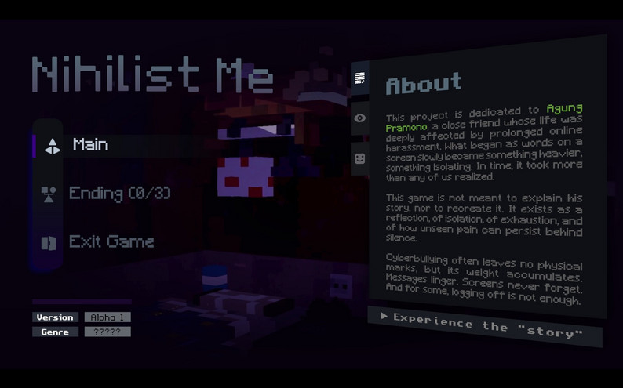
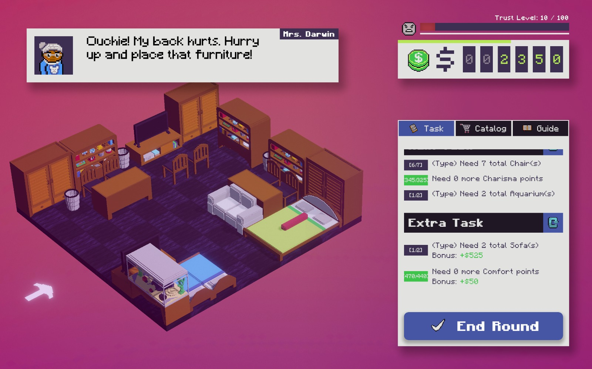
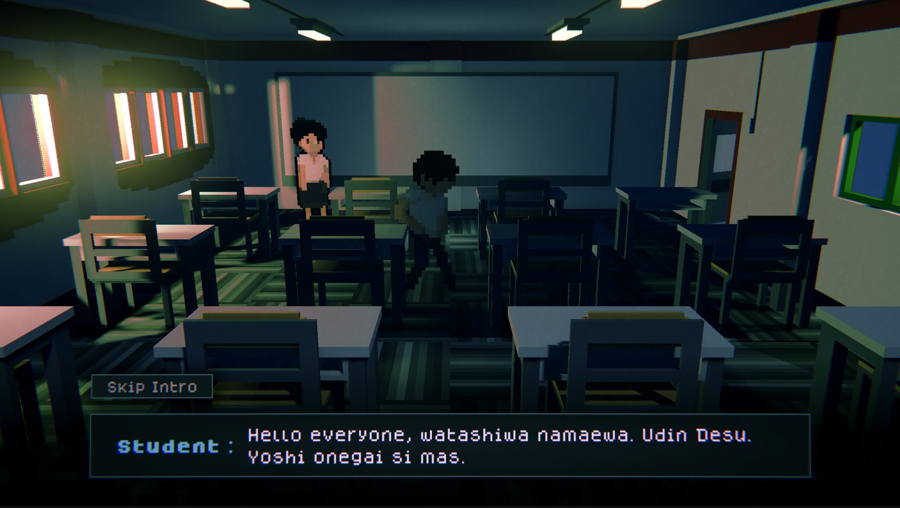
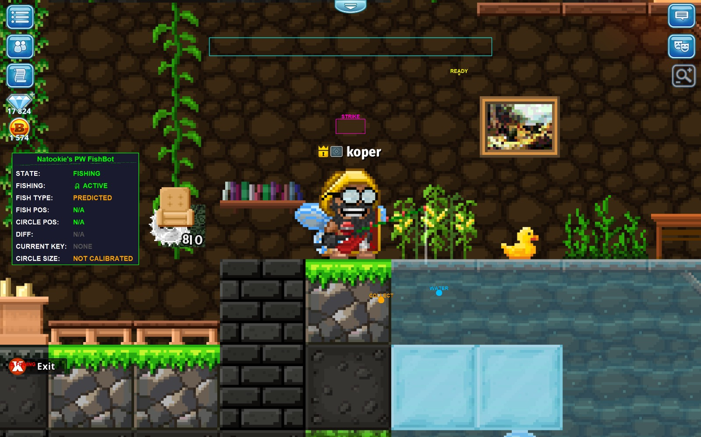

<h1>
  <b>Natanael Kevin Kurniawan</b>
  &nbsp;&nbsp;&nbsp;&nbsp;&nbsp;&nbsp;&nbsp;&nbsp;&nbsp;&nbsp;&nbsp;&nbsp;&nbsp;&nbsp;&nbsp;&nbsp;
  
  &nbsp;
  
  &nbsp;
  
  &nbsp;
  
</h1>

<b>Game Developer | Undergraduate at Binus University — Game Application & Technology</b>. I specialize in <b>Unity Engine</b> and <b>C# game programming</b>, building efficient gameplay systems and clean architecture.

 

  
  &nbsp;&nbsp;&nbsp;
  
  &nbsp;&nbsp;&nbsp;
  

 

  <table width="100%" border="0" cellpadding="8" cellspacing="0">
    <tbody>
      <tr>
        <td width="12%" valign="top" style="border: none; white-space: nowrap;"><b>Tools</b></td>
        <td width="88%" valign="top" style="border: none; width: 100%;">
          
          
          
          
          
        </td>
      </tr>
      <tr>
        <td width="12%" valign="top" style="border: none; white-space: nowrap;"><b>Languages</b></td>
        <td width="88%" valign="top" style="border: none; width: 100%;">
          
          
          
          
          
          
          
          
          
        </td>
      </tr>
      <tr>
        <td width="12%" valign="top" style="border: none; white-space: nowrap;"><b>Database</b></td>
        <td width="88%" valign="top" style="border: none; width: 100%;">
          
          
        </td>
      </tr>
    </tbody>
  </table>

---

<h2>🟢 Game Projects</h2>

<table width="100%" border="0" cellpadding="16" cellspacing="0">
  <tbody>
    <tr>
      <td width="35%" align="center" valign="top" style="border: none; background-color: #0D1117; border-radius: 16px; padding: 8px;">
        
       </td>
      <td width="65%" valign="top" style="border: none; padding-left: 24px;">
        <h3 style="margin: 0 0 4px 0;">Nihilist Me</h3>
        <i style="color: #FF79C6;">Logical Fallacy Debate Simulator</i>
          
        
A narrative-driven story about a shut-in who gets cyberbullied and becomes obsessed with finding logical fallacies in online debates. Players can engage in debates with an LLM using their own custom topics.

        

        

          
          
          
        

        

        

          
          &nbsp;
          
        

      </td>
    </tr>
  </tbody>
</table>

 

<table width="100%" border="0" cellpadding="16" cellspacing="0">
  <tbody>
    <tr>
      <td width="35%" align="center" valign="top" style="border: none; background-color: #0D1117; border-radius: 16px; padding: 8px;">
        
      </td>
      <td width="65%" valign="top" style="border: none; padding-left: 24px;">
        <h3 style="margin: 0 0 4px 0;">Room For One More</h3>
        <i style="color: #FF79C6;">Roguelike Furniture Management</i>
          
        
A spatial optimization game where every tile on a <b>10x10 grid</b> matters. Place furniture strategically, manage limited space, and create a cozy room layout.

        

        

          
          
        

        

        

          
          &nbsp;
          
        

      </td>
    </tr>
  </tbody>
</table>

 

<table width="100%" border="0" cellpadding="16" cellspacing="0">
  <tbody>
    <tr>
      <td width="35%" align="center" valign="top" style="border: none; background-color: #0D1117; border-radius: 16px; padding: 8px;">
        
      </td>
      <td width="65%" valign="top" style="border: none; padding-left: 24px;">
        <h3 style="margin: 0 0 4px 0;">Butt Pressure</h3>
        <i style="color: #FF79C6;">Time Scramble — Find a Restroom Before It's Too Late</i>
          
        
A linear narrative game following Udin, a new student who urgently needs to find a restroom. Quick decision-making under time pressure with branching dialogue and multiple endings.

        

        

          
          
        

        

        

          
          &nbsp;
          
        

      </td>
    </tr>
  </tbody>
</table>

 

<h2>🔵 Silly Projects</h2>

<table width="100%" border="0" cellpadding="16" cellspacing="0">
  <tbody>
    <tr>
      <td width="35%" align="center" valign="top" style="border: none; background-color: #0D1117; border-radius: 16px; padding: 8px;">
        
      </td>
      <td width="65%" valign="top" style="border: none; padding-left: 24px;">
        <h3 style="margin: 0 0 4px 0;">Natookie's PW Fish Bot</h3>
        <i style="color: #FF79C6;">Automated Fishing Bot for Pixel World</i>
          
        
A computer vision automation tool that detects fishing mechanics and performs actions. Built with OpenCV for image recognition and PyAutoGUI for input simulation.

        

        

          
          
        

        

        

          
        

      </td>
    </tr>
  </tbody>
</table>

---

  <code>💤 Always eepy but never stops coding</code>

