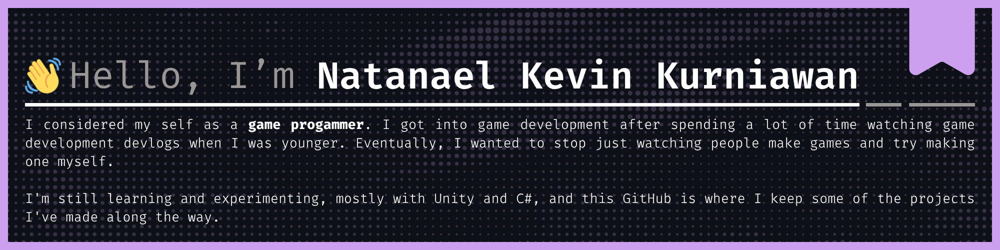

> Currently studying **Game Application & Technology at BINUS University**.

  
  
  

## ⬇ Selected Game Projects

<table>
  <tr>
  <td width="50%" valign="top">

  ### Nihilist Me

  <video height="100%" autoplay loop muted playsinline>
    <source src="Videos/NihilistMe.mp4" type="video/mp4">
  </video>

  **Logical Fallacy Debate Simulator**

  A narrative-driven game where players debate an LLM (Mistral) on custom topics while trying to identify logical fallacies in the conversation.

  **Stack**

  
  
  

  
  
  </td>

  <td width="50%" valign="top">

  ### Carccident

  <video height="100%" autoplay loop muted playsinline>
    <source src="Videos/Carccident.mp4" type="video/mp4">
  </video>

  **Traffic Light Controller**

  An arcade game about managing a busy intersection by controlling four traffic lights across eight lanes and keeping traffic flowing without collisions.

  **Stack**

  
  

  
  
  </td>
  </tr>

  <tr>
  <td width="50%" valign="top">

  ### Butt Pressure

  <video height="100%" autoplay loop muted playsinline>
    <source src="Videos/ButtPressure.mp4" type="video/mp4">
  </video>

  **Time-Limited Narrative Game**

  A short narrative game about "Udin," a new student desperately trying to find a toilet while navigating an unfamiliar school.

  **Stack**

  
  

  
  
  </td>

  <td width="50%" valign="top">

  ### Aspull

  <video height="100%" autoplay loop muted playsinline>
    <source src="Videos/Aspull.mp4" type="video/mp4">
  </video>

  **Snake-Like Arcade Game**

  A twist on the classic Snake game where players dodge falling blocks. Inspired by the visual style of classic console interfaces.

  **Stack**

  
  

  
  
  </td>
  </tr>

  <tr>
  <td width="50%" valign="top">

  ### Room For One More

  <video height="100%" autoplay loop muted playsinline>
    <source src="Videos/RoomForOneMore.mp4" type="video/mp4">
  </video>

  **Roguelike Furniture Management**

  A spatial optimization game built around a 10×10 grid, where players arrange furniture to satisfy a demanding grandmother.

  **Stack**

  
  

  
  
  </td>

  <td width="50%" valign="top">

  ### Viles W/ Smiles

  <video height="100%" autoplay loop muted playsinline>
    <source src="Videos/VilesWSmiles.mp4" type="video/mp4">
  </video>

  **Cozy Drink Making Game**

  A twisted cozy game about a bartender forced to work for the mafia to pay off his debt.

  **Stack**

  
  

  
  
  </td>
  </tr>
</table>

## ⬇ Some Silly Projects

<table>
  <tr>
  <td width="50%" valign="top">

  ### Pixel World's Fishing Bot

  

  **Automated Fishing Script**

  A bot that automates the fishing minigame in Pixel World by using visual recognition to handle timing and inputs.

  **Stack**

  

  
  </td>

  <td width="50%" valign="top">

  ### Monkey Art

  <video height="100%" autoplay loop muted playsinline>
    <source src="Videos/MonkeyArt.mp4" type="video/mp4">
  </video>

  **Pixel Art Workflow Toolkit**

  A web-based toolkit for palette generation, shading, color blending, and pixel-art workflows.

  **Stack**

  
  
  

  
  
  </td>
  </tr>
</table>

### ⟬ Technical Focus ⟭

| Game Development | Programming |
| :--- | :--- |
|   |   |

| Tools | Databases |
| :--- | :--- |
|    |   |

### ⟬ More About Me ⟭
I enjoy making games with cinematic lighting and a more realistic visual style, but I don't particularly enjoy building large environments from scratch. That's one reason I find 2.5D games especially interesting to work on.

As a player, I find games with a bit of grind surprisingly enjoyable. There's something satisfying about working toward a goal and finally seeing it through.

  Eepy 24/7

